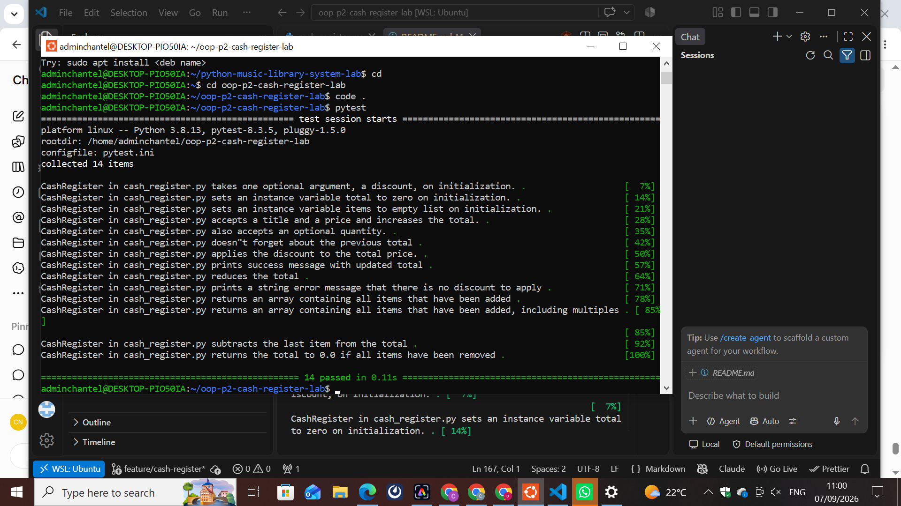

# Cash Register Lab

## Module Lab: Object-Oriented Programming Part 2

### Description

This project is a Python Cash Register application created to practice Object-Oriented Programming (OOP).

The project uses a `CashRegister` class to manage items, calculate totals, apply discounts, keep records of previous transactions, and void transactions.

## Learning Goals

In this lab, I learned how to:

* Create and use a Python class.
* Work with instance attributes.
* Create methods that modify object data.
* Calculate the total cost of items.
* Apply discounts to purchases.
* Keep track of items in a cash register.
* Store previous transactions.
* Void transactions.
* Run automated tests using `pytest`.
* Use Git and GitHub for version control.

## Project Structure

```text
oop-p2-cash-register-lab/
│
├── lib/
│   ├── cash_register.py
│   └── testing/
│       ├── cash_register_test.py
│       └── conftest.py
│
├── README.md
└── pytest.ini
```

## CashRegister Class

The main class in this project is called `CashRegister`.

The class is used to manage purchases and transactions.

The Cash Register keeps track of:

* `discount`
* `total`
* `items`
* `previous_transactions`

## Attributes

### discount

Stores the discount percentage that can be applied to a purchase.

### total

Stores the total cost of the items in the current transaction.

### items

Stores the items that have been added to the cash register.

### previous_transactions

Stores information about previous transactions.

## Cash Register Methods

The `CashRegister` class contains methods that allow the register to perform different operations.

### add_item()

Adds an item to the cash register and updates the total.

### apply_discount()

Applies the discount percentage to the current total.

### void_last_transaction()

Removes the most recent transaction and updates the cash register.

## Testing

This project uses `pytest` to test the functionality of the `CashRegister` class.

Run the tests using:

```bash
pytest
```

The tests passed successfully.

## Test Screenshot

The screenshot below shows the completed test results:



## Best Practices

The project follows these best practices:

* Used clear class and method names.
* Added comments to explain the purpose and logic of the code.
* Used automated tests to check the functionality.
* Removed unnecessary commented-out code.
* Removed generated `__pycache__` files.
* Used Git for version control.
* Used a feature branch when developing the project.
* Updated the README to document the project.
* Added a screenshot of the completed work.

## Git Workflow

The Cash Register project was developed using a feature branch:

```bash
git checkout -b feature/cash-register
```

After completing the implementation and testing the project, the changes were prepared for the main branch.

The repository was checked to make sure there were no unnecessary changes or generated files.

## How to Run the Project

### 1. Clone the repository

```bash
git clone https://github.com/nyabokechantel83-dev/oop-p2-cash-register-lab.git
```

### 2. Enter the project folder

```bash
cd oop-p2-cash-register-lab
```

### 3. Run the tests

```bash
pytest
```

## Technologies Used

* Python
* Object-Oriented Programming (OOP)
* Pytest
* Git
* GitHub

## Conclusion

This project helped me practice Object-Oriented Programming concepts in Python by building a Cash Register system.

The application can manage items, calculate totals, apply discounts, and keep track of transactions.

The project was tested using `pytest` and the tests passed successfully.
